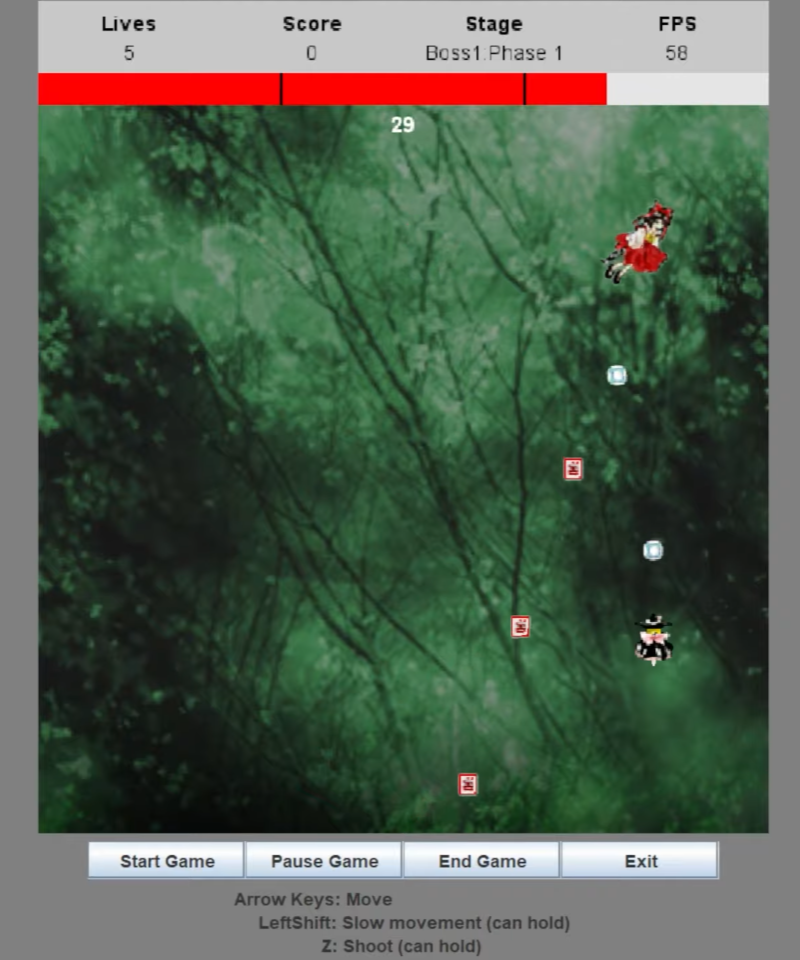
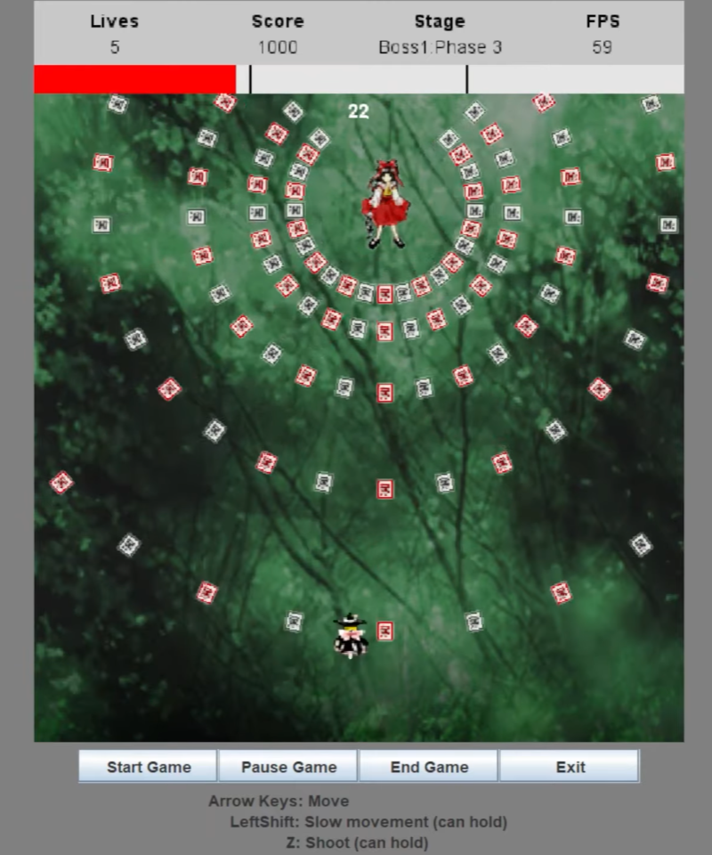
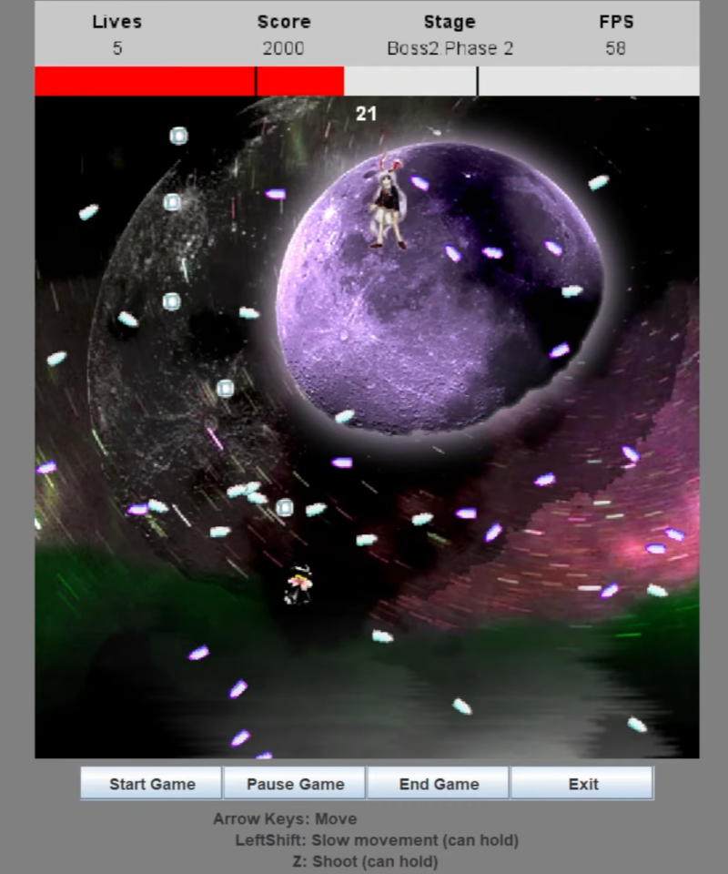
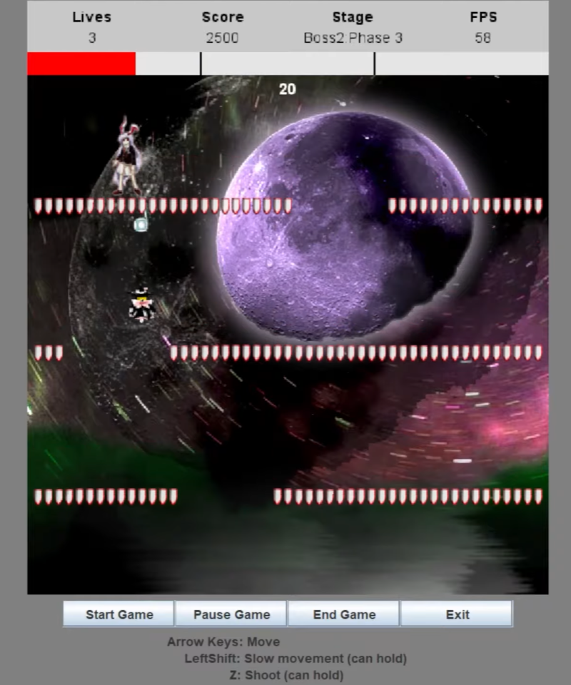

# DefinitelyTouhou
A vertical scrolling bullet hell shooter game mimicking games from Touhou Project, written in Java.
This game was made for a Game Programming course project and technology was limited to course teachings. Hence there are many things that could be improved if no restrictions on implementation were present.

## Controls
**Arrow keys** – Movement  
**LeftShift** – Slow player movement (for more precise dodging)  
**Z** – Shoot bullet 

To start the game, press the "Start Game" button, then begin moving upwards.

## Gameplay
The player can shoot bullets vertically upwards to damage a boss and can slow their own
movement for increased precision. Each boss has multiple phases and will attack the
player by shooting bullets in various patterns unique to each phase. The player loses a life
upon colliding with a boss projectile or the boss themselves. Once all phases are defeated,
the boss is defeated. The player must complete all phases within their time limits to defeat
each boss, and in turn win the game.

The game is lost if the player runs out of time for any phase, or if they lose all their lives.

## Previews






## Scoring
Each successfully completed phase is worth 500 score. If the player wins the game, they
also get bonus score for each of their remaining lives. The score calculation is as follows:

```
Base score = # of completed phases * 500
Bonus score (if game won) = # of remaining lives * 400
Total score = Base Score + Bonus Score
```

The game has 6 phases total, and the player starts with 5 lives, therefore:
```
Max score = (6 * 500) + (5 * 400) = 5000
```
A player would need to complete all bosses without losing any lives to achieve the
maximum score.
